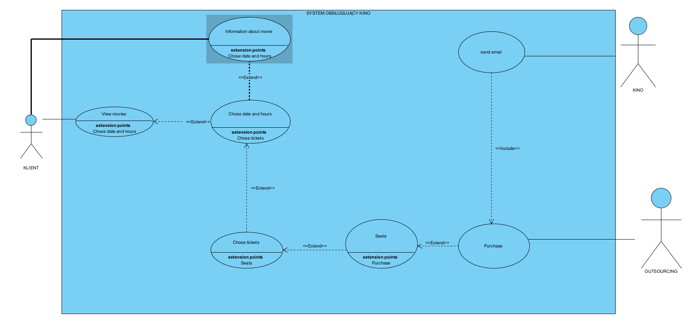

# project-io

Użytkownik ma możliwość przeglądania oferty filmowej. Klikając w miniaturkę filmu, ma możliwość podglądu opisu filmu oraz jego ocen. Następnie klient wybiera datę, godzinę seansu oraz jego typ. W dalszej kolejności wybiera rodzaj biletu, ich ilość. Następnie pojawia się układ sali kinowej, gdzie użytkownik wybiera miejsca. Klient ma możliwość wyboru w pierwszej kolejności miejsc obok siebie, jeśli tylko jest taka możliwość. Następnie klient przechodzi do ekranu z formularzem danych, gdzie również wybiera rodzaj płatności obsługiwaną przez zewnętrznego operatora. Po sfinalizowaniu płatności, klient otrzymuje wiadomość z informacjami na temat płatności oraz pliki biletów. Na końcu pojawia się przycisk z możliwością powrotu do menu głównego.

